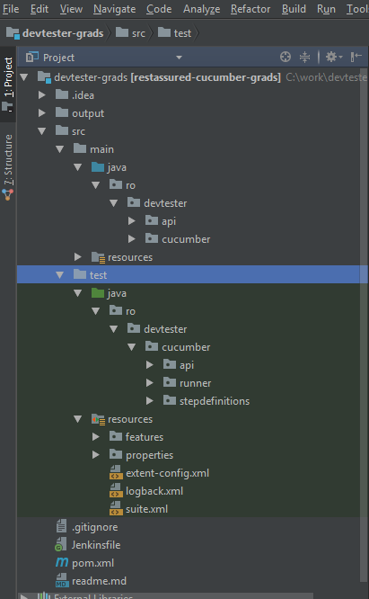
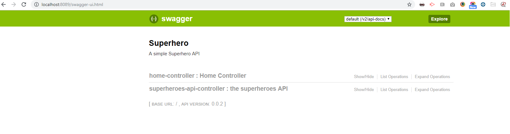

[[basic-project]]
== Basic Project

In this Lab we will look at the basic project that we will integrate with Jenkins.

=== Step 1: GitHub Clone

After completing this section, you will have the basic knowledge of this sample project:

- Browse to -> https://github.com/devtester-ro/devtester-grads
- Select `Clone or download` -> Copy the Url -> https://github.com/devtester-ro/devtester-grads.git
- Open IntelliJ -> `VCS` -> `Checkout from version control` -> `Git` -> Paste the url and hit `Clone`
- Open the Project in a new window or the same window.

=== Step 2: Build and Run Application

[source,shell]
----
mvn clean install -DskipTests
----

[source,shell]
----
[INFO] ------------------------------------------------------------------------
[INFO] BUILD SUCCESS
[INFO] ------------------------------------------------------------------------
[INFO] Total time: 11.279 s
[INFO] Finished at: 2019-08-13T17:16:25+03:00
[INFO] Final Memory: 40M/534M
[INFO] ------------------------------------------------------------------------
----

[source,shell]
----
mvn spring-boot:run
----

[source,shell]
----
  .   ____          _            __ _ _
 /\\ / ___'_ __ _ _(_)_ __  __ _ \ \ \ \
( ( )\___ | '_ | '_| | '_ \/ _` | \ \ \ \
 \\/  ___)| |_)| | | | | || (_| |  ) ) ) )
  '  |____| .__|_| |_|_| |_\__, | / / / /
 =========|_|==============|___/=/_/_/_/
 :: Spring Boot ::        (v2.1.5.RELEASE)

2019-08-13 17:17:51.939  INFO 23164 --- [           main] ro.devtester.api.SuperheroesApplication  : Starting SuperheroesApplication on EN614662 with PID 23164 (C:\work\
devtester-grads\target\classes started by ipetcu in C:\work\devtester-grads)
2019-08-13 17:17:51.946  INFO 23164 --- [           main] ro.devtester.api.SuperheroesApplication  : No active profile set, falling back to default profiles: default
2019-08-13 17:17:55.659  INFO 23164 --- [           main] o.s.b.w.embedded.tomcat.TomcatWebServer  : Tomcat initialized with port(s): 8089 (http)
2019-08-13 17:17:55.747  INFO 23164 --- [           main] o.apache.catalina.core.StandardService   : Starting service [Tomcat]
2019-08-13 17:17:55.749  INFO 23164 --- [           main] org.apache.catalina.core.StandardEngine  : Starting Servlet engine: [Apache Tomcat/9.0.19]
2019-08-13 17:17:56.059  INFO 23164 --- [           main] o.a.c.c.C.[Tomcat].[localhost].[/]       : Initializing Spring embedded WebApplicationContext
2019-08-13 17:17:56.062  INFO 23164 --- [           main] o.s.web.context.ContextLoader            : Root WebApplicationContext: initialization completed in 3550 ms
2019-08-13 17:17:56.978  INFO 23164 --- [           main] pertySourcedRequestMappingHandlerMapping : Mapped URL path [/v2/api-docs] onto method [public org.springframewo
rk.http.ResponseEntity<springfox.documentation.spring.web.json.Json> springfox.documentation.swagger2.web.Swagger2Controller.getDocumentation(java.lang.String,javax.serv
let.http.HttpServletRequest)]
2019-08-13 17:17:57.243  INFO 23164 --- [           main] o.s.s.concurrent.ThreadPoolTaskExecutor  : Initializing ExecutorService 'applicationTaskExecutor'
2019-08-13 17:17:59.794  INFO 23164 --- [           main] org.mongodb.driver.cluster               : Cluster created with settings {hosts=[localhost:27017], mode=SINGLE,
 requiredClusterType=UNKNOWN, serverSelectionTimeout='30000 ms', maxWaitQueueSize=500}
2019-08-13 17:17:59.941  INFO 23164 --- [           main] d.s.w.p.DocumentationPluginsBootstrapper : Context refreshed
2019-08-13 17:18:00.025  INFO 23164 --- [           main] d.s.w.p.DocumentationPluginsBootstrapper : Found 1 custom documentation plugin(s)
2019-08-13 17:18:00.167  INFO 23164 --- [           main] s.d.s.w.s.ApiListingReferenceScanner     : Scanning for api listing references
2019-08-13 17:18:00.778  INFO 23164 --- [           main] o.s.b.w.embedded.tomcat.TomcatWebServer  : Tomcat started on port(s): 8089 (http) with context path ''
2019-08-13 17:18:00.783  INFO 23164 --- [           main] ro.devtester.api.SuperheroesApplication  : Started SuperheroesApplication in 9.91 seconds (JVM running for 23.653)
----

=== Step 3: Open App

- Open Browser at - `http://localhost:8089`

=== Step 4: Open Talk about the project

- Main Application
- Spring and Swagger
- Tests and Report

*Congrats you have a running application!*

link:2-OpenShift.adoc[Next Lab: OpenShift] | link:0-Readme.adoc[Table Of Contents]