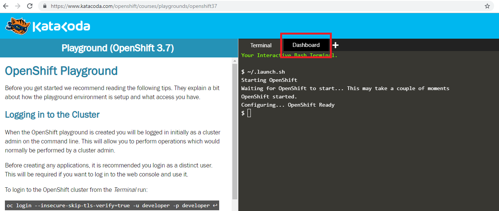
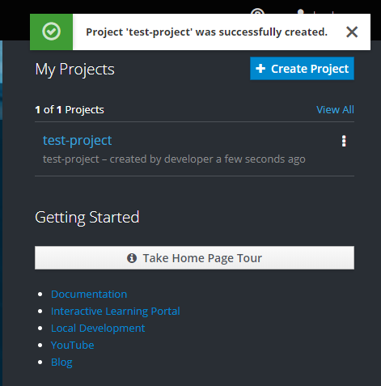
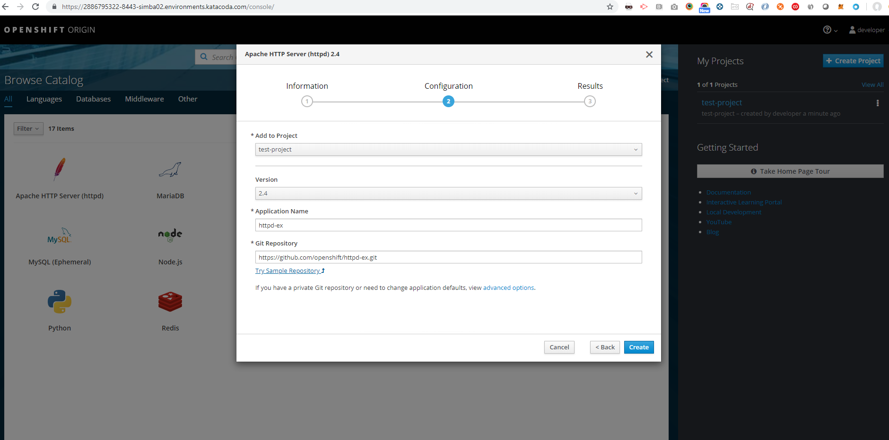
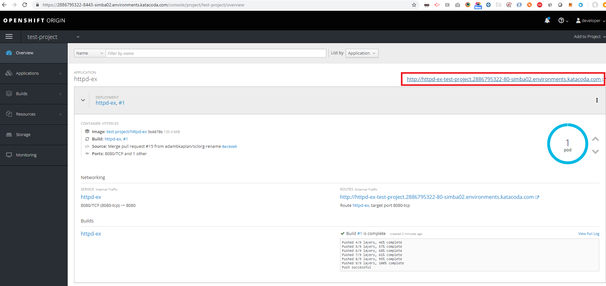

[[openshift]]
== OpenShift

In this Lab we will look at the basic project that we will integrate with Jenkins.

=== Step 1: Open KataCoda

After completing this section, you will know how to use OpenShift:

- Browse to -> https://www.katacoda.com/openshift/courses/playgrounds/openshift37
- Select `Start Scenario`
- Select `Dashboard`

- Input `developer` with `developer` as credentials
- Next to Getting Started -> `Create Project`

=== Step 2: Deploy an application to OpenShift

- Browse the catalog
- Select `Apache HTTP Server` -> `Try Sample Repository`

- Select your project and see that a new app is available
- Wait several seconds until the `Pod` is up and try the highlighted link

=== Step 3: Open Talk about the OpenShift

- Deploy Apps
- App logs and configurations
- Routes and Storage
- Membership

*Congrats we can now move on to deploy a jenkins instance!*

link:3-Jenkins-In-OpenShift.adoc[Next Lab: Jenkins In OpenShift] | link:0-Readme.adoc[Table Of Contents]