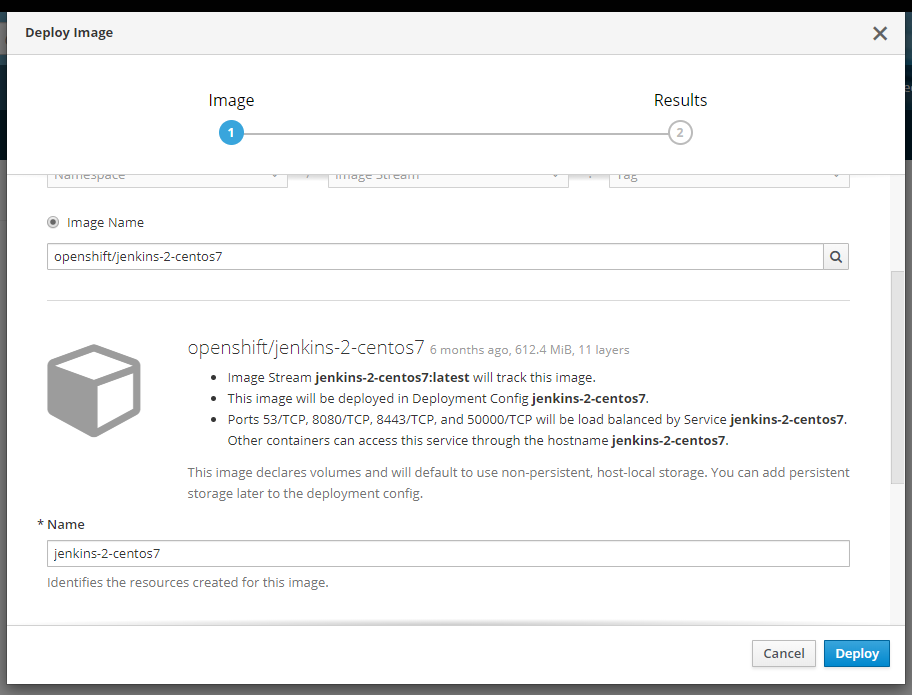
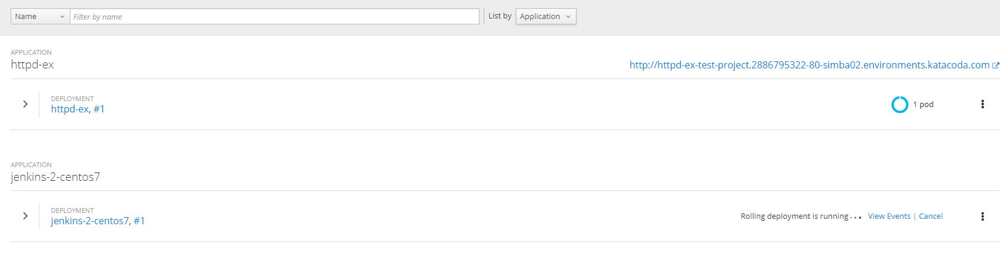
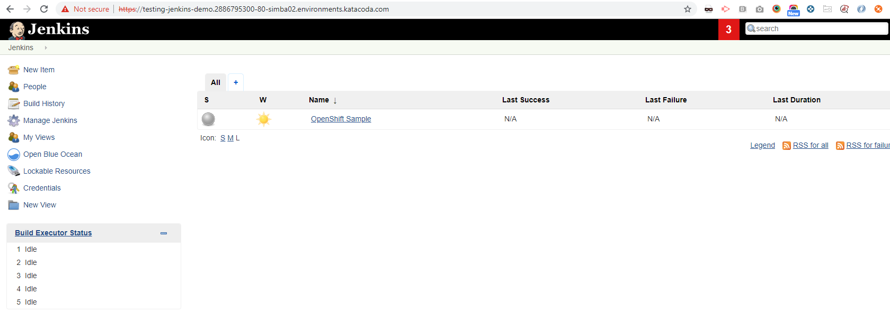

[[jenkins-in-openshift]]
== Jenkins In OpenShift

In this Lab we will have an Jenkins up and running.

*Note* - from here on we are timebound for 60 minutes so we must make sure that everything works as good as possible.

=== Step 1: Open a new instance of KataCoda

- Browse to -> https://www.katacoda.com/openshift/courses/playgrounds/openshift37
- Create a new project -> `jenkins-demo`
- Instead of selecting a predefined app from the catalog -> `Deploy Image`
- Tick the `Image Name` -> input -> `openshift/jenkins-2-centos7`
- Now just `Deploy`

- After the pod is running we need to create an `route`

*Note* - there will be some issues caused by KataCoda for exposing routes but we will manage them.

*Congrats we all have deploy a jenkins instance!*

link:4-Configure-Jenkins.adoc[Next Lab: Configure Jenkins] | link:0-Readme.adoc[Table Of Contents]