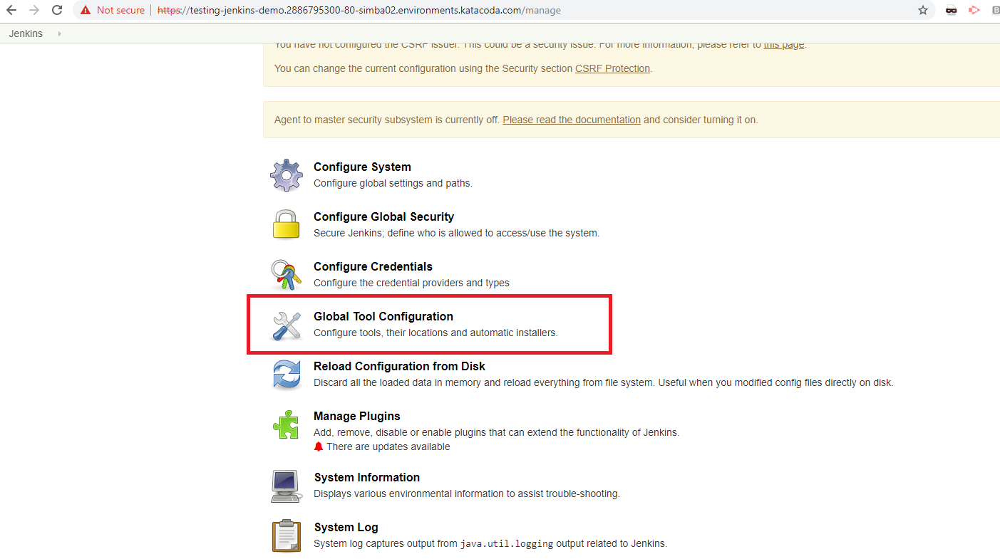

[[configure-jenkins]]
== Configure Jenkins

In this Lab we will configure Jenkins so it can build a maven project with Java 8.

=== Step 1: Configure Jenkins

- Select -> `Manage Jenkins`
- Scroll down to `Global Tool Configuration` and select.

- Configure JDK and Maven with Maven - name `M3` Java name - `jdk-8`
- For java account username and password will be provided

- Save the changes

*Congrats jenkins is now able to build your project!*

link:5-Create-First-Job.adoc[Next Lab: Create First Jenkins Job] | link:0-Readme.adoc[Table Of Contents]