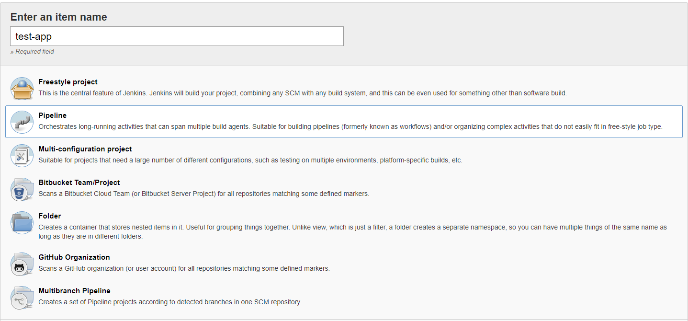
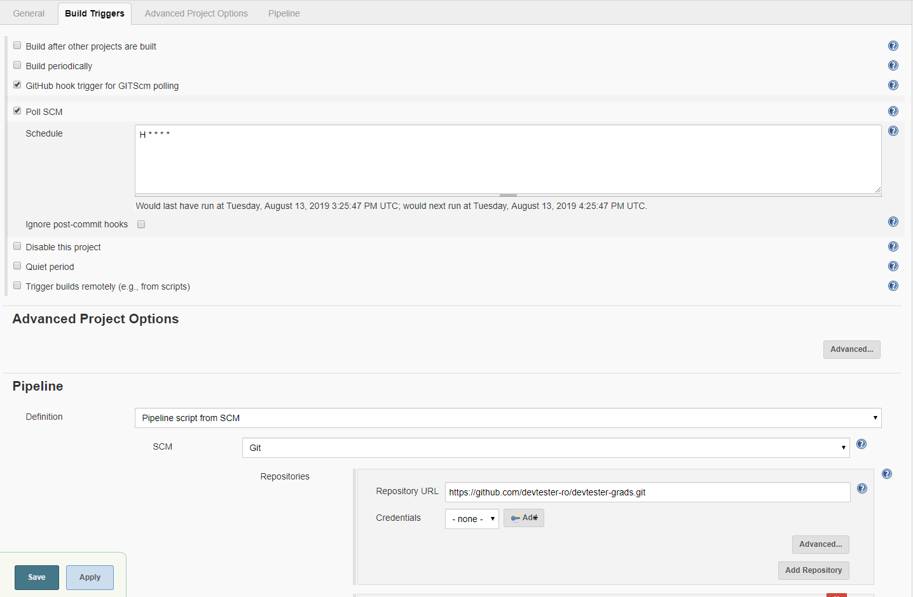

[[create-job-jenkins]]
== Create First Jenkins Job

In this Lab we will create a job within Jenkins.

=== Step 1: Create Job

- Select -> `New Item`
- Give it a `Name`
- Select -> `Pipeline`

=== Step 2: Configure Job

- Build triggers -> `GitHub hook trigger for GITScm polling` + `Poll SCM` with `H * * * *`
- Pipeline -> `Pipeline script from SCM` -> `Git` -> `https://github.com/devtester-ro/devtester-grads.git`

- Save the changes

*Congrats jenkins is now able to build your project!*

link:5-Create-First-Job.adoc[Next Lab: Create First Jenkins Job] | link:0-Readme.adoc[Table Of Contents]